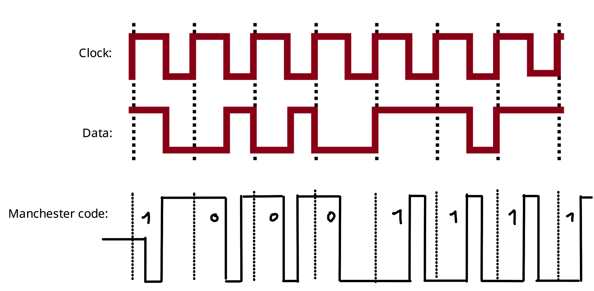

# Hausaufgabe

## A1

Die Programme startet jeh nach übergebenen Argument ein sendendes Programm oder ein empfangedes Programm. Mit dem Sendenden Programm können Nachrichten an das empfangende Programm gesendet werden, welche anschließend auf der Konsole ausgegeben werden.

Der Unterschied der beiden Programme ist das verwendete Layer 4 Protokoll.
Eines der beiden Programme nutzt udp während das andere tcp nutzt.
Während bei udp ein Paket unter Angabe der Ip und des Port direkt an das sendende Programm gesendet werden kann (siehe A1_udp.pcap), muss bei tcp eine Verbindung hergestellt werden. Dies geschieht durch das durchführen eines dreistufigen Handshakes.

1. Sender schickt `SYN` Nachricht.
2. Server sendet `SYN-ACK` Nachricht.
3. Sender antwortet mit `ACK` Nachricht.

Jetzt besteht eine Verbindung der beiden Instanzen und es können Nachrichten ausgetauscht werden.

## A2

Um das Programm unter Linux zu starten, führen sie den Befehl

```bash!
./gradlew runMain_udp --args="<name>" --console=plain
```

oder unter Windows

```bash
./gradlew.bat runMain_udp --args="<name>" --console=plain
```

im Root-Verzeichnis des Projekts aus.
Eine Übersicht der verfügbaren Befehle kann durch das drücken der Entertaste eingesehen werden. Instanzen müssen sich erst bei einer anderen Instanz registrieren, bevor sie miteinander kommunizieren können.

## A3

Um den `Server` unter Linux zu starten, führen sie den folgenden Befehl aus.

```bash!
./gradlew runMain_tcp --console=plain
```

Um den `Client` zu starten, führen Sie den folgenden Befehl aus.

```bash
./gradlew runMain_tcp --args="<name> <server_ip> <server_port>"
```

Analog mit Windows, starten sie den `Server` mit dem folgenden Befehl.

```bash
./gradlew.bat runMain_tcp --pconsole=plain
```

Der Client kann unter Windows mit dem folgenden Befehl gestartet werden.

```bash
./gradlew.bat runMain_tcp --args="<name> <server_ip> <server_port>"
```

Instanzen behalten eine dauerhafte Verbindung zum Server. Diese wird genutzt, um bei Beitritt eines weiteren `Clients` ein aktualisiertes Verzeichnis aller bekannten Adressen an die `Clients` zu schicken. Instanzen registrieren sich also automatisch durch Anmeldung beim `Server`.

## A4

Ich interpretiere für die Aufgabe 4 das Clock-Signal so, dass bei steigender Flanke das sich zu diesem Zeitpunkt auf der Datenleitung befindliche Bit gesendet wird.
Die Clock startet für mich bei null.
Weiter interpretiere ich das Datensignal so, dass "oben" die Einsen sind und "unten" die Nullen. Da bei manchen Stellen nicht eindeutig erkennbar ist, ob das Signal vor oder nach dem Clock-Signal sich verändert, nehme ich an, dass es sich immer vor dem Clock-Signal verändert.

Damit ergibt sich die folgende Bitfolge:

```bash
10001111
```

Daraus ergibt sich der folgende Manchester Code nach IEEE 802.3

