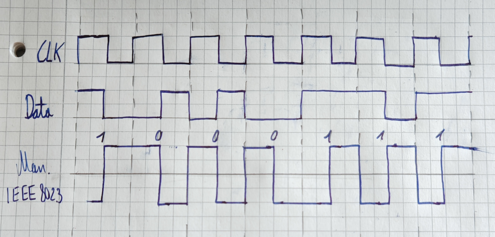

Abgabe von Maxim Smirnov

# Aufgabe 1

Ich beziehe mich auf die Java-Programme netcat TCP und netcat UDP.
Das UDP-Programm startet einen Server, der nur Nachrichten empfängt mit dem Programm-Argument `-l <port>`.
Um eine Nachricht an diesen Server zu senden, kann das Programm-Argument `<ip> <port>` verwendet werden um eine Verbindung aufzubauen.
Zunächst wird nur ein Socket erstellt um Nachrichten an den Server zu senden. Erst wenn man eine Nachricht in die Konsole eingibt,
wird eine Nachricht an den Server gesendet. (siehe UDP.pcapng)

Das TCP-Programm startet ebenfalls einen Server, der nur Nachrichten empfängt, mit dem Programm-Argument `-l <port>`. Jedoch bekommt jeder
Client eine eigene Verbindung zu dem Server, das heißt jeder Client bekommt einen eigenen Thread der die Nachrichten empfängt.
Wenn ein Client sich mit dem Programm-Argument `<ip> <port>` verbinden möchte, wird zuerst ein SYN-Paket an den Server gesendet.
Der Server antwortet mit einem SYN-ACK-Paket, welches der Client mit einem ACK-Paket bestätigt. 
Erst wenn eine Verbindung aufgebaut ist, kann der Client Nachrichten an den Server senden.
Jede Nachricht welche vom Client gesendet wird und vom Server empfangen wird, wird mit einem ACK-Paket bestätigt.
Wenn der Client geschlossen wird, sendet er dem Server ein RST-Paket, um die Verbindung zu schließen. (siehe TCP.pcapng)
Im Vergleich zum UDP-Programm wird beim TCP-Programm eine Verbindung aufgebaut und sichergestellt, dass die Nachrichten auch wirklich ankommen.
Die einzige Gemeinsamkeit zwischen den beiden Programmen ist, dass sie beide einen Server haben, der nur Nachrichten
empfangen kann, die von Clients gesendet wird.

# Aufgabe 2

Das Java-UDP-Programm wurde zu einem Chatprogramm erweitert -> siehe UDP_Chatold.java
Mit dem Programm-Argument `<Name des Clients> <Port>` wird der Client gestartet. 
Mit dem Befehl `connect <ip> <port> (optional: <name>)` kann man sich bei einer anderen Instanz registrieren.
Anschließend kann man mit `send <name> <message>` Nachrichten an andere Instanzen senden.

Der Connect Befehl sendet ein Paket an die angegebene IP-Adresse und Port-Nummer, welches die eigene IP-Adresse und Port-Nummer enthält.
Wenn man den Namen des Gegenüber sofort mit angibt ((optional: <name>)), wird dieser in der Kontaktliste gespeichert. Ansonsten muss der
Gegenüber erst einen connect Befehl senden, damit der Kontakt in der Kontaktliste gespeichert wird.

Bsp. Konversation:

Client 1:  

UDP Chat client started with name 'Charlie', IP '192.168.178.21', Port '11243'  
connect 127.0.0.1 11242 Bob  
Connected to Bob at 127.0.0.1:11242  
send Bob Hallo  
Message sent to Bob  
Wie gehts  

Client 2:  

UDP Chat client started with name 'Bob', IP '192.168.178.21', Port '11242'  
Hallo, hier ist Charlie, meine IP-Adresse ist die 192.168.178.21 und du kannst mich unter Port-Nummer 11243 erreichen.  
Connected to: Charlie (192.168.178.21:11243)  
Hallo  
send Charlie Wie gehts  
Message sent to Charlie  

# Aufgabe 3

Das Java-TCP-Programm wurde zu einem Chatprogramm überarbeitet -> siehe TCP_Chat.java
Mit dem Programm-Argument `-l <Port>` wird der Server gestartet. Mit `<ServerIP> <ServerPort> <ClientName>` wird ein Client gestartet, der sich beim Server registriert.
Ein Client kann dann mit dem Befehl `send <name> <message>` Nachrichten an andere Clients senden, die beim selben Server registriert sind.

In TCPChat.pcapng sieht man die folgende Konversation mit Wireshark aufgezeichnet.
Bei meinem Programm sieht man leider nicht wer der Absender der Nachricht ist. Aber hier ein Beispiel wie es funktioniert:

Server:  

TCP Chat Server started on IP '192.168.178.21', Port '12456' 
Registered Client as Charlie and added to the list.  
Registered Client as Bob and added to the list.  
Message sent to Bob  
Message sent to Charlie  

Client 1:  

TCP Chat Client started with name 'Charlie', IP '192.168.178.21', Port '49998'  
Registered as Charlie  
send Bob Hiii  
Message sent to Bob  
Heeey  

Client 2:  

TCP Chat Client started with name 'Bob', IP '192.168.178.21', Port '49999'  
Registered as Bob  
Hiii  
send Charlie Heeey  
Message sent to Charlie  

# Aufgabe 4
Manchester-Code nach IEEE 802.3 (siehe Bild unten oder ManchesterCodierung.jpg):

